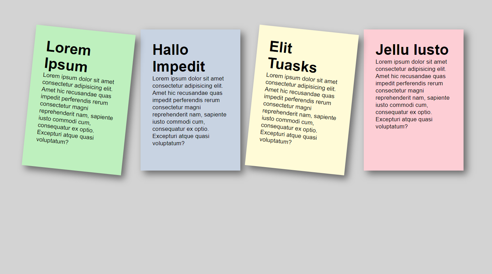
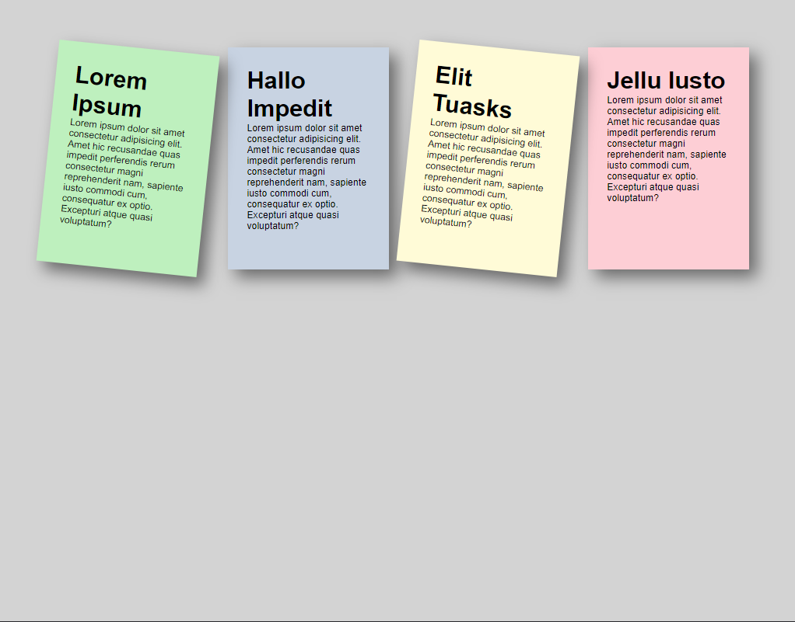
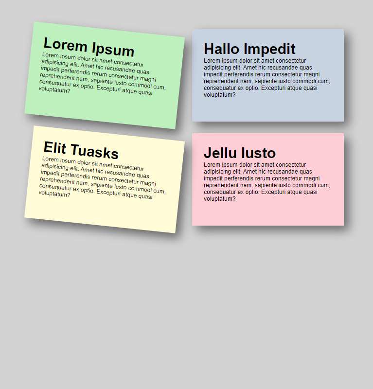
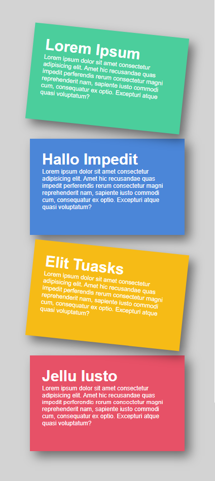
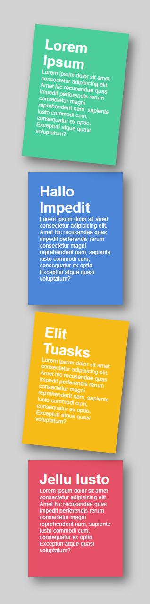

# Tarea 2

## Indicaciones Generales

- El ejercicio debe estar desarrollado en un archivo nombrado index.html y debe extraer los estilos de una hoja externa nombrada como styles.css

 

 

<!-- 01 -->

## Exercise

Crear un layout de post-its que se adapte a los cambios de pantalla, haciendo uso de las herramientas que hemos visto en clase (media queries, flexbox, unidades en porcentajes, etc). Las vistas para cada breakpoint son las siguientes:

- Vista de 1440px (PCs y Laptops grandes) en adelante  
  

- Vista de 1024px (Laptops pequeñas) en adelante  
  

- Vista de 768px (Tablets grandes) en adelante  
  

- Vista de 425px (Tablets pequeñas y dispositivos móviles) en adelante  
  

- Vista de 320px (Dispositivos móviles pequeños) en adelante  
  
